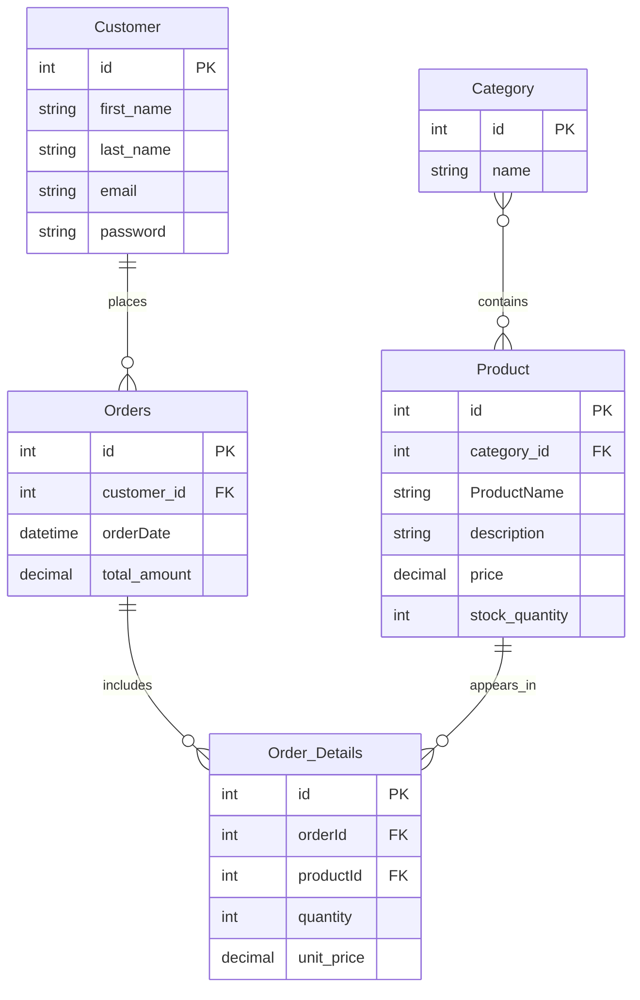



# E-Commerce Database Design Documentation

## Overview

This document provides a detailed design for a simple e-commerce database system. It includes the database schema, entity relationships, example SQL queries for reporting, and denormalization strategies. The purpose is to provide a clear understanding of the database structure and how to perform common queries.

----------

## 1. Database Schema

**Entities and their descriptions:**

### 1.1 Category

Represents the product categories.

-   `id` (INT, PK): Unique identifier for the category.
    
-   `name` (VARCHAR): Name of the category.
    

### 1.2 Product

Represents the products being sold.

-   `id` (INT, PK): Unique product identifier.
    
-   `category_id` (INT, FK): References the category.
    
-   `name` (VARCHAR): Product name.
    
-   `description` (TEXT): Product description.
    
-   `price` (DECIMAL): Product price.
    
-   `stock_quantity` (INT): Number of items in stock.
    

### 1.3 Customer

Represents customers who place orders.

-   `id` (INT, PK): Unique customer ID.
    
-   `first_name` (VARCHAR)
    
-   `last_name` (VARCHAR)
    
-   `email` (VARCHAR, UNIQUE)
    
-   `password` (VARCHAR)
    

### 1.4 Orders

Represents customer orders.

-   `id` (INT, PK)
    
-   `customer_id` (INT, FK): Customer placing the order.
    
-   `order_date` (DATE)
    
-   `total_amount` (DECIMAL)
    

### 1.5 Order Details

Represents the products in each order.

-   `order_details_id` (INT, PK)
    
-   `order_id` (INT, FK)
    
-   `product_id` (INT, FK)
    
-   `quantity` (INT)
    
-   `unit_price` (DECIMAL)
    

**Schema SQL:**

Category :
```sql
CREATE TABLE category (
    id INT PRIMARY KEY AUTO_INCREMENT,
    name VARCHAR(100) NOT NULL
);
```

Product:
```sql
CREATE TABLE product (
    id INT PRIMARY KEY AUTO_INCREMENT,
    category_id INT,
    name VARCHAR(150) NOT NULL,
    description TEXT,
    price DECIMAL(10,2) NOT NULL,
    stock_quantity INT NOT NULL,
    FOREIGN KEY (category_id) REFERENCES category(category_id)
);
```

Customer :
```sql
CREATE TABLE customer (
    id INT PRIMARY KEY AUTO_INCREMENT,
    first_name VARCHAR(100) NOT NULL,
    last_name VARCHAR(100) NOT NULL,
    email VARCHAR(150) UNIQUE NOT NULL,
    password VARCHAR(255) NOT NULL
);
```

Orders :
```sql
CREATE TABLE orders (
    id INT PRIMARY KEY AUTO_INCREMENT,
    customer_id INT,
    order_date DATE NOT NULL,
    total_amount DECIMAL(10,2) NOT NULL,
    FOREIGN KEY (customer_id) REFERENCES customer(customer_id)
);
```

 Order_details:
```sql
CREATE TABLE order_details (
    id INT PRIMARY KEY AUTO_INCREMENT,
    order_id INT,
    product_id INT,
    quantity INT NOT NULL,
    unit_price DECIMAL(10,2) NOT NULL,
    FOREIGN KEY (order_id) REFERENCES orders(order_id),
    FOREIGN KEY (product_id) REFERENCES product(product_id)
);
```

----------

## 2. Relationships


### **category → product**

-   **One-to-Many**
    

### **product → order_details**

-   **One-to-Many**
    

### **customer → orders**

-   **One-to-Many**
    

### **orders → order_details**

-   **One-to-Many**
    

### **product ↔ orders**

-   **Many-to-Many**
    
-   Achieved through **order_details**

----------

## ERD Diagram:



----------

## 3. SQL Queries

### 3.1 Daily Revenue Report

**Description:** Calculate total revenue for a specific date.

```sql
SELECT order_date, SUM(total_amount) AS daily_revenue
FROM orders
WHERE order_date = '2025-11-15'
GROUP BY order_date;

```

### 3.2 Monthly Top-Selling Products

**Description:** List products with the highest quantity sold in a given month.

```sql
SELECT p.id, p.name, SUM(od.quantity) AS total_quantity_sold
FROM order_details od
JOIN product p ON od.product_id = p.id
JOIN orders o ON od.order_id = o.id
WHERE o.order_date BETWEEN '2025-02-01' AND '2025-02-28'
GROUP BY p.product_id, p.name
ORDER BY total_quantity_sold DESC;

```

### 3.3 Customers Who Spent > $500 in Past Month

**Description:** Retrieve customers who placed orders totaling more than $500 in the last 30 days.

```sql
SELECT c.customer_id, CONCAT(c.first_name, ' ', c.last_name) AS customer_name, SUM(o.total_amount) AS total_spent
FROM customer c
JOIN orders o ON c.customer_id = o.customer_id
WHERE o.order_date >= NOW() - INTERVAL 30 DAY
GROUP BY c.customer_id, customer_name
HAVING total_spent > 500
ORDER BY total_spent DESC;

```
